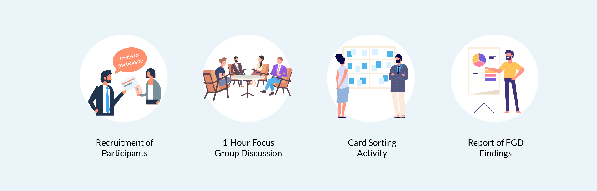

# Focus Group

# Définition de Focus Group:

Le focus group est un protocole d'enquête qui vise à recueillir l'opinon des utilisateurs sur un produit ou un concept.
Elle permet de récolter les opinions et le ressenti des utilisateurs à propos d'une iterface, d'une fonctionnalité ou d'un service.
C'est au final une méthode qualitative afin d'obtenir des données subjectives.

# D'ou vient cette méthode ?

Les bases ont été posées par deux sociologues américains du nom de Merton et Kendall en 1946, durant la seconde guerre mondiale.
A la base, il s'agissait d'entretiens focalisés "Focused Interviews", destinés à saisir l'impact de la propagande radiophonique sur la population.
Les personnes sélectionnées devaient écouter un extrait audio puis ensuite partager leur ressenti.

Ce principe à été repris mais dans des discussions de groupe ouvertes, afin de pouvoir comparer les expériences et au final avoir obtenir des données,
ce qui est à la fois rapide et pratique.

Aujourd'hui, la méthode du Focus Group est encore utilisé en sciences sociales mais aussi dans les domaines du marketing, de la communication et de la conception IHM.

# Les Objectifs du Focus Group:

L'objectif du Focus Group est d'abordés les points définir au préalable avec l'équipe projet, et des informations qu'elle souhaite recueillir.
Les participants du groupe sont poussés à intéragir tout en stmulant à la fois leur créativité et leur sens critique.
Chaque thème fait l'objet d'une discussion de groupe ou d'une activité spécifique afin de recueillir leurs perceptions, leurs envies et les idées à exploiter.

# Pourquoi ne pas utiliser:
-Pour prendre une décision finale
-Pour répondre à la qquestion "combien"
-Pour sauver du temps ou de l'argent par rapport à des méthodes quantitatives.

# Les différents procédés du Focus Group:

-Par questionnement : pour identifier les motivation des utilisateurs ou les faire réagir sur un nouveau design, par exemple.
-Par activité de groupe: participation des utilisateurs afin de réaliser en petits groupes une maquette de l'interface "idéale", chaque groupe va présenter celle ci
aux autres présidents.

Auteur : BOURDIN Joris