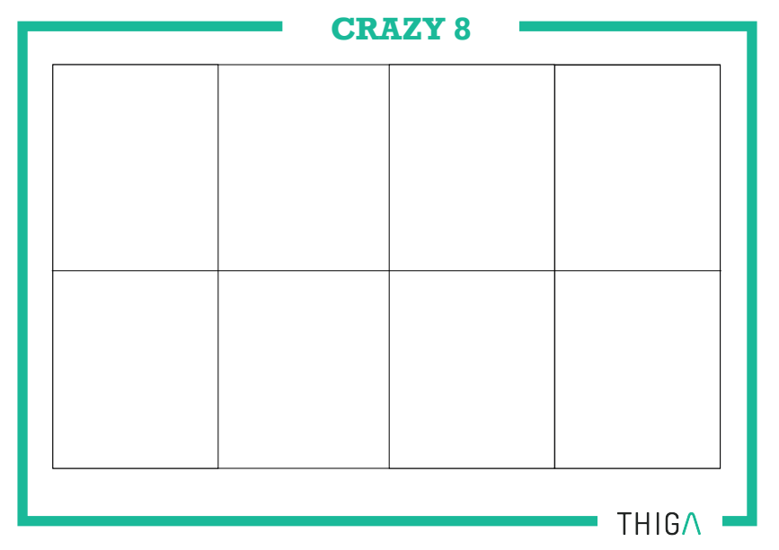

# Crazy eight

## Qu’est-ce que c’est ?

Crazy eight est un atelier utilisé en entreprise pour généralement créer ou améliorer un produit. Cet atelier fonctionne avec plusieurs personnes, il est utilisé lorsque le délai disponible pour faire la tâche est assez court. Cela permet d’expérimenter un atelier d’un tout nouveau type au sein de l’équipe.

*Tableau de jeu du Crazy eight*

## Comment ça marche ?

Sur la taille d’une feuille A3, chaque personne devra la diviser en 8 cadres comme sur l’image ci-dessous :

Ensuite chaque personne va devoir commencer par faire une feature du produit en question avec un temps qui est limité à 40 secondes par cadre et 20 secondes de pause entre chaque. Si on calcule, le temps mis à faire les 8 cadres, on arrive à 8 minutes.

Ensuite, chaque personne va présenter ses cadres aux membres du groupe, puis ces personnes vont pouvoir débattre et s’inspirer des autres pour améliorer les idées qu’ils ont eues. Cette phase est appelée la phase de divergence.
L’idéal, si on a plus de temps, serait de refaire encore l’exercice une à 2 fois pour que les idées du groupe puissent aboutir le plus possible.

Pour finir, il y a un vote de fait où les membres du groupe vont pouvoir choisir les meilleures idées qui vont permettre de définir par la suite ce qui sera retenu.

## Quel est son objectif ?

Cet atelier permet de mettre chaque membre dans la peau du futur utilisateur, car il va imaginer comment le produit peut lui plaire et lui convenir le mieux. La contrainte de temps va permettre à chacun d’aller à l’essentiel et de se rendre compte de la difficulté que peut donner ce travail. Le fait de travailler à plusieurs permet aussi à chaque personne d’apporter sa pierre à l’édifice. 

Auteur : LEMONNIER Baptiste - [@BaptisteKSP](https://github.com/BaptisteKSP)