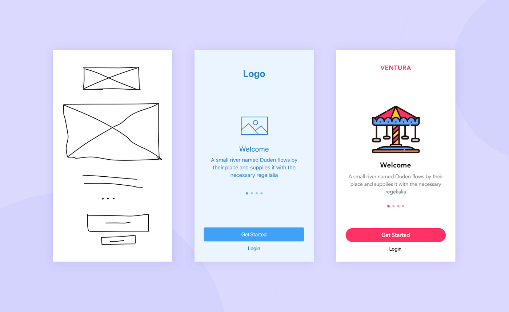

# Wireframes

# Définition de Wireframes:

Le Wireframe ou une maquette fonctionnelle est une façon de représenter une conception digitale,
c'est un schéma utilisé lors de la conception d'une interface utilisateur
pour définir les zones et composant qu'elle doit contenir pour un site, une application, une interface, etc. 
Cette maquette n'est pas interactif et peu détaillés.

  

# Les différents types de Wireframes:

Les différents types de wireframes dépend du niveau de représentation:

**-low fidelity ("basse-fidélité"):** 
Ce sont habituellement des croquis en noir et blanc dessinés sur un morceau de papier.
Les éléments de l'interface utilisateur sont représentés sous formes de carrés et de ligne non détaillées.
Leur objectif principal est de permettre aux développeurs de comprendre le concept.

**-mid fidelity ("moyenne-fidélité"):** 
Ce sont des croquis dessinés avec des outils (Sketch, Figma, inVision)
Les concepteurs utilisent une palette monochrome ou des nuances de gris pour faire la conception.
Cela permet d'obtenir des wireframes plus détaillés avec des éléments d'interface utilisateur plutôt réalistes.
Et cela permet de voir si il ya des fonctionnalités supplémentaire à fusionner avec les fonctions principales.

**-high fidelity ("haute-fidélité"):** 
Ce sont des croquis seulement créés à l'aide d'outils de conception.
La différence entre les autres typres de wireframes est que celui ci va ressembler à un produit prêt à l'emploi avec des éléments bien détaillés. 
De telles strucutres filaires peuvent être testées sur la conformité aux exigences pour les personnes ayant différents type de perception.

# Les caractéristiques d'un Wireframe:

Les wireframes représentent une interface sobre.  
Les designers intègrent généralement les éléments graphiques et contenus suivants:

-montrer les principaux éléments du contenu 
-représenter le périmètre et la structure de la mise en page 
-décrire l’interface utilisateur élémentaire 
-la maquette  
C'est une représentatio visuelle d'un produit. Alors qu'un wireframe représente principalement la strucutre d'un produit (mid-fi ou high-fi), une maquette
montre à quoi le produit va ressembler(low-fi). 

-le prototype 
C'est une représentation haute fidélité du produit final, c'est une simulation de l'interaction de l'utilisateur.
Mais ce n'est pas le produit final.

La différence entre le produit final et le prototype est que l'interface et le backend ne sont pas souvent liés. 
Cela sert à réduire les coûts de développement jusqu'à l'approbation de l'interface utilisateur. 
Toutes les conceptions web ne passent pas toujours par les trois étapes wireframe, maquette ou même prototype, mais chaque étape présente des avantages.

# Les avantages des Wireframes:

Un wireframe n'est pas coûteux et rapide à réaliser.
Les clients accordent plus d'attention à la fonctionnalité et l'expérience utilisateur qu'à l'esthétique.
De plus, les wireframes empêchent les parties prenantes de faire dérailler les réunions pour des détails non pertinents.
Ils sont donc plus concentrés sur les intéractions plutpot que sur les éléments visuels. 
Un wireframe est utile car on peut apporter d'autres solutions rapidement et donc corriger quelques détails.

Au final, quelque soit l'utilisation du wireframe, son but n'est pas d'être soigné, mais d'être **pertinent**. 
Il permet avant tout d'avancer dans une bonne direction, toujours en accord avec le client.

Auteur : BOURDIN Joris