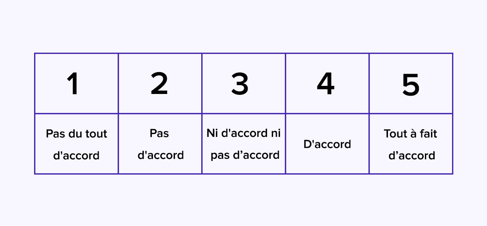
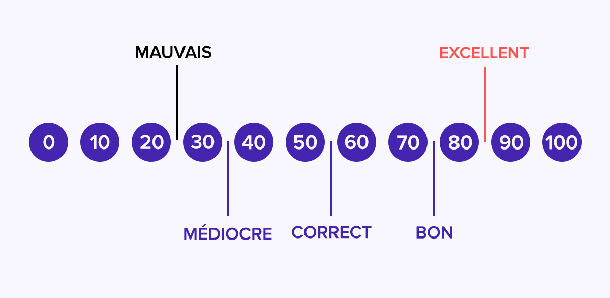

# Questionnaire SUS

# Définition:

SUS (System Usability Scale = Echelle d'Utilisabilité du Système) est un questionnaire "quick and dirty" qui est généralement utilisé après avoir manipulé l'interface.
Les participants doivent répondre à un questionnaire de dix question en utilisant une échelle de Likert allant de
"Pas du tout d'accord" à "Tout à fait d'accord".
A la fin de ce questionnaire, un score est calculé et peut être comparé à celui obtenur par d'autres interfaces. 

# Comment se présente le SUS:

Le questionnaire System Usability Scale utilise l'échelle de Likert.
Pour chacune des 10 questions posées, il y a 5 réponses possible allant de "Pas du tout d'accord" à "Tout à fait d'accord".

A la fin de se questionnaire, nous avons un score de satisfaction.
Celui ci est compris entre 1 à 100, un score est dit "bon" à partir de 75, passable ou correct entre 50 et 75.
Un score inférieur à 50 révèle de gros problèmes en termes de satisfaction client.

# Les 10 questions du SUS:

Afin de répondre facilement aux question, elles seront toujours posées sous forme d'affirmation.
Elles sont souvent adaptées en fonctione de la nature de votre service.

1. Je pense que vais utiliser le service fréquemment

2. Je pense que le service est inutilement complexe

3. Je pense que le service est facile d’utilisation 

4. Je pense que je vais devoir faire appel au support technique pour pouvoir utiliser ce service

5. Je trouve que les fonctionnalités du service sont bien intégrées

6. Je trouve qu’il y a beaucoup trop d’incohérences dans ce service

7. Je pense que la plupart des gens apprennent très rapidement à utiliser le service

8. Je trouve le service vraiment très lourd à utiliser

9. Je me suis senti très confiant en utilisant ce service

10. J’ai dû apprendre beaucoup de choses avant de pouvoir utiliser ce service

# Comment calculer le score SUS ?

Le score final est compris entre 0 et 100, qui n'est pas en pourcentage.

Voici le mode de calcul du SUS:
Pour les questions impaires, à consonnance positive, vous devez soustraire 1 au résultat donné par le répondant.
Si le répondant répond 4, le score correspondant est 3 (4-1).
 
Pour les questions paires à consonnance négative, le score est égal à 5 moins le score donné par le répondant. 
Si le répondant répond 3, le score est de 2 (5-3).
 
Une fois le total calculé, vous devez le multiplier par 2,5. Vous obtenez ainsi le score SUS compris entre 0 et 100.

Par exemple, pour avoir un score SUS de 100, il faut que le répondant réponde 5 à toutes les questions impaires et 0 à toutes les questions paires.

# A quel moment le questionnaire SUS est utile ?

Le questionnaire peut être proposé aux clients ou utilisateurs par email.
Ils sont souvent inviter à répondre au questionnaire via un email en de période d'essai par exemple.

Il faut éviter d'envoyer le questionnaire trop tôt, il faut laisser les utilisateurs du temps pour qu'ils aient eu suffisamment de temps pour tester vos service.

Le bon timing dépend de la nature du service évalué (J+15, la plupart du temps)

Auteur : BOURDIN Joris